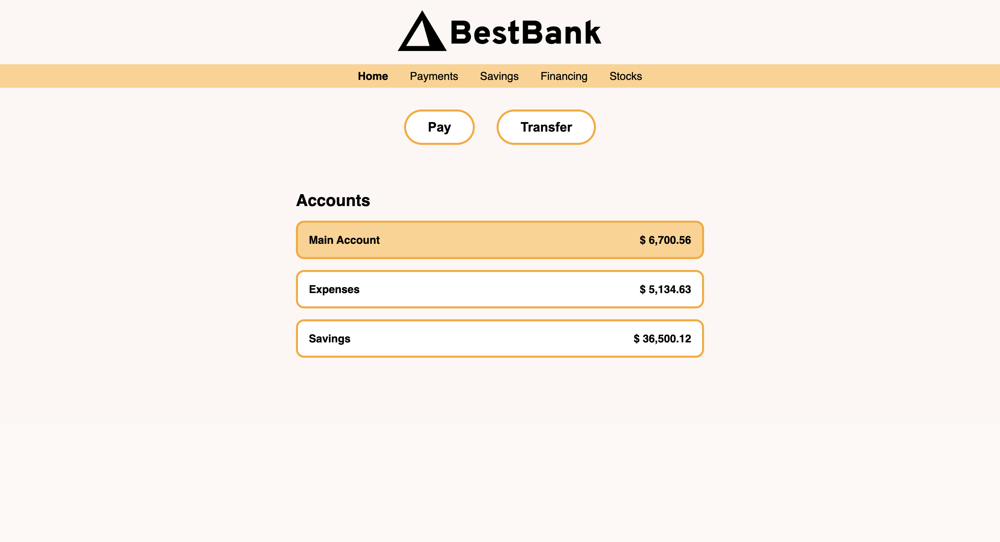

# 💰 BestBank UI Lab

Welcome to BestBank. We’re modern, we’re clean.

In this lab, you're going to **build a simple bank dashboard** using only HTML and CSS. No JavaScript. No frameworks. Just you, the DOM, and a dream.

---

## 📐 What You’re Building



You’re recreating this simple interface:

- A logo header
- A horizontal nav bar
- Buttons to take action (like “Pay” and “Transfer”)
- A list of bank accounts styled like little cards

Your goal: **match the layout and styling as closely as possible**.

Here's a little taste of what the HTML structure will look like:

```html
<!DOCTYPE html>
<html lang="en">
<head>
  <meta charset="UTF-8">
  <meta name="viewport" content="width=device-width, initial-scale=1.0">
  <title>BestBank</title>
  <link rel="stylesheet" href="index.css">
</head>
<body>
  <!-- Start here -->
</body>
</html>
```

## 🎨 Color Palette

Use these brand-approved BestBank™️ colors in your CSS:

```
BLACK:       #000000
WHITE:       #FFFFFF
LIGHT:       #FDF7F4

ORANGE:      #FFD18C
DARK ORANGE: #FFA724
```
We don’t care how you get rich, but your buttons better be orange. 😎

## 🛠 Required Layout

Here’s a breakdown of the sections you need:

1. Header
    An image for the logo. Centered. Like a CEO’s ego.

2. Navigation Bar
    A row of links: Home, Payments, Savings, Financing, Stocks.
    Highlight the "Home" link to show it's active.

3. Actions Section
    Two buttons: "Pay" and "Transfer".
    Make them round and bold, like a confident transaction.

4. Accounts Section
    A titled section with three accounts listed (Main, Expenses, Savings).
    Each one shows a name + balance.
    Make the "Main Account" stand out with a background color.

## 😏 Pro Tips
- Use flexbox for layout (you’ll thank yourself later).

- Keep your CSS organized—the graders can smell chaos.

- Don’t forget alt text for images. BestBank is inclusive, even to screen readers.


## ✅ Running Tests

Once you’ve built your beautiful BestBank, let’s make sure it holds up to scrutiny (like any good credit check).

In your terminal, run:

```bash
npm install
npm run test
```


## 🏁 When You’re Done

Ask yourself:

- Does it look like the mockup?

- Are you proud enough to show your fake bank to your real friends?


Push your files, commit with a cheesy message like feat: add juicy orange buttons, and bask in your digital wealth.

Happy coding 🚀

